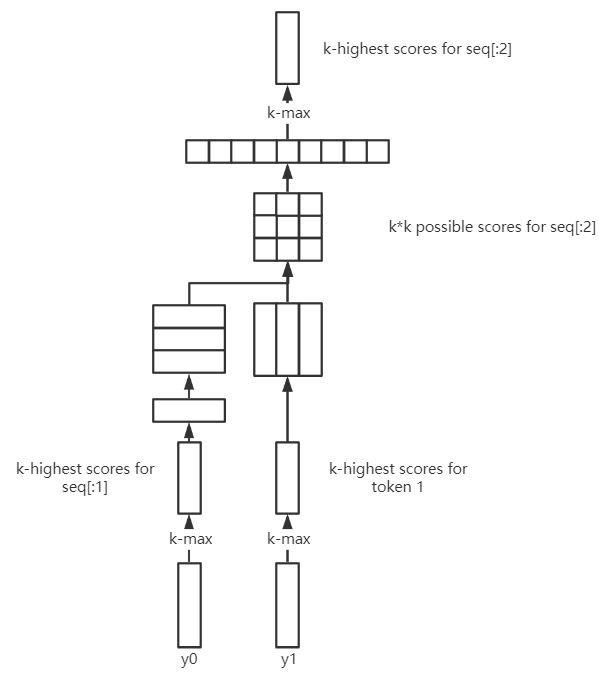

# UniLM Code

## Preprocess (seq2seq_loader.py)

### Preprocess for Seq2seq Decoder

This is the preprocessor for `decode_seq2seq.py`, which takes lines of source sequences as input and outputs the corresponding target sequences.

- Add special tokens
- Token indexing
- Zero padding
- Segment encoding, position encoding
- Mask configuration
- Leave white space for output (target) sequence

### Preprocess for Seq2seq

This is the preprocessor for `run_seq2seq.py`, which trains the UniLM as seq2seq LM.The preprocess method is similar to above, except it also encodes the output (target) sequence.

## Beam Search (decode_seq2seq.py)

The beam search algorithm is the essential part of `decode_seq2seq.py`.

### In a Figure



The code is an iteration, where the first iteration and the iterations afterwards are very different. So I read the code twice, from perspectives of the first iteration and the iterations afterwards.

### First Iteration

- Get the K highest probabilities and corresponding indices (ids) of each score vector

  ```py
  kk_scores, kk_ids = torch.topk(log_scores, k=K)
  k_ids = torch.reshape(kk_ids, [batch_size, K])
  back_ptrs = torch.zeros(batch_size, K, dtype=torch.long)
  k_scores = torch.reshape(kk_scores, [batch_size, K])
  '''
  - kk_scores: shape (batch_size, 1, K)
  - kk_ids: shape (batch_size, 1, K)
  - k_ids: shape (batch_size, K)
  - back_ptrs: shape (batch_size, K), ?
  - k_scores: shape (batch_size, K), K-most probable words of each current output probability
  '''
  ```

- Append the back_ptrs, k_ids, beam_masks, k_scores to list

  ```py
  step_back_ptrs.append(back_ptrs)  # all-zero
  step_ids.append(k_ids)  # the indices (ids) of previous k-most probable words
  beam_masks.append(torch.eq(k_ids, self.eos_id).float())  # to see if there is [EOS]
  total_scores.append(k_scores)  # the scores (probabilities) of previous k-most probable words
  ```

- Assign prev_embedding, prev_encoded_layers, and reshape k_ids

  ```py
  prev_embedding = first_expand(new_embedding)
  '''
  - new_embedding: shape (batch_size, seq_len, embed_len)
  - prev_embedding: shape (batch_size * K, seq_len, embed_len), each sequence is repeated for K-times
  '''
  prev_encoded_layers = [first_expand(x) for x in new_encoded_layers]
  '''
  new_encodede_layers: List<(batch_size, seq_len, h_len)>
  prev_encoded_layers: List<(batch_size * K, seq_len, h_len)>, each hidden sequence is repeated for K-times
  '''
  curr_ids = torch.reshape(k_ids, [batch_size * K, 1])
  '''
  (batch_size, K) -> (batch_size * K, 1)
  '''
  ```

- Expand inputs for following iterations

  ```py
  token_type_ids = first_expand(token_type_ids)
  position_ids = first_expand(position_ids)
  attention_mask = first_expand(attention_mask)
  mask_ids = first_expand(mask_ids)
  ```

- Iterate on each batch

  ```py
  # [(batch, beam)]
  total_scores = [x.tolist() for x in total_scores]
  step_ids = [x.tolist() for x in step_ids]
  step_back_ptrs = [x.tolist() for x in step_back_ptrs]
  # back tracking
  traces = {'pred_seq': [], 'scores': [], 'wids': [], 'ptrs': []}
  for b in range(batch_size):
      # [(beam,)]
      scores = [x[b] for x in total_scores]
      wids_list = [x[b] for x in step_ids]
      ptrs = [x[b] for x in step_back_ptrs]
      traces['scores'].append(scores)
      traces['wids'].append(wids_list)
      traces['ptrs'].append(ptrs)
  '''
  - traces['scores']: e.g. [[(S111,S112),],[(S211,S212),(S221,S222)],], where Sxyz means the z-th probable score of the y-th token of the x-th sequence in the batch
  - traces['wids']: the corresponding word ids
  - traces['ptrs']: ?
  '''
  ```

- Compute pred_seq

  ```py
  # --- Inside the iteration on batch ---
  # find the eos token
  last_frame_id = len(scores) - 1
  for i, wids in enumerate(wids_list):  # for each token
      if all(wid == self.eos_id for wid in wids):
          last_frame_id = i
          break
  
  # find the most possible word of the last token
  max_score = -math.inf  # score (possibility)
  frame_id = -1  # which token (of the sequence)
  pos_in_frame = -1  # which word (of the K possible words)
  for fid in range(last_frame_id + 1):  # for each token
      for i, wid in enumerate(wids_list[fid]):  # for each possible
          if wid == self.eos_id or fid == last_frame_id:
              s = scores[fid][i]
              if self.length_penalty > 0:
                  s /= math.pow((5 + fid + 1) / 6.0,
                                self.length_penalty)
              if s > max_score:
                  max_score = s
                  frame_id = fid
                  pos_in_frame = i
  
  if frame_id == -1:
      traces['pred_seq'].append([0])
  else:
      seq = [wids_list[frame_id][pos_in_frame]]
      # traceback according to the beam search tree
      for fid in range(frame_id, 0, -1):
          pos_in_frame = ptrs[fid][pos_in_frame]
          seq.append(wids_list[fid - 1][pos_in_frame])
      seq.reverse()
      traces['pred_seq'].append(seq)
  ```

### Iterations Afterwards

- Compute the scores of the currently possible subsequences

  ```py
  kk_scores, kk_ids = torch.topk(log_scores, k=K)
  '''
  - kk_scores: shape (batch_size * K, 1, K)
  - kk_ids: shape (batch_size * K, 1, K)
  '''
  last_eos = torch.reshape(
      beam_masks[-1], [batch_size * K, 1, 1])
  last_seq_scores = torch.reshape(
      total_scores[-1], [batch_size * K, 1, 1])
  kk_scores += last_eos * (-10000.0) + last_seq_scores  # accumulated scores
  # In the (K, K) elements, each row means each previous subsequence, while each col means current token
  kk_scores = torch.reshape(kk_scores, [batch_size, K * K])
  k_scores, k_ids = torch.topk(kk_scores, k=K)
  ```

- Back pointers and k_ids

  ```py
  # divided by K, the result means which row the score is at in (K, K) relation matrix, 
  # namely which previous subsequence, namely which previous token_id
  back_ptrs = torch.div(k_ids, K)
  kk_ids = torch.reshape(kk_ids, [batch_size, K * K])
  k_ids = torch.gather(kk_ids, 1, k_ids)  # recover k_ids
  ```

The process afterwards is similar to that in the first iteration.

### Traceback

Key code

```py
seq = [wids_list[frame_id][pos_in_frame]]  # [the most possible word of the last token]
for fid in range(frame_id, 0, -1):  # from the last token to the second token
    pos_in_frame = ptrs[fid][pos_in_frame]
    seq.append(wids_list[fid - 1][pos_in_frame])
seq.reverse()
traces['pred_seq'].append(seq)
```

## BertForPreTrainingLossMask (run_seq2seq.py)

`run_seq2seq.py` is used to train the UniLM, and this model is the significant part.

### Build Attention Mask

The `task_idx` variable is passed to the model, determining the currently used attention mask, thus the current training task (LM).

```py
task_0 = (task_idx == 0)
task_1 = (task_idx == 1)
task_2 = (task_idx == 2)
task_3 = (task_idx == 3)

sequence_length = input_ids.shape[-1]
index_matrix = torch.arange(sequence_length).view(
    1, sequence_length).to(input_ids.device)

num_tokens = num_tokens_a + num_tokens_b

# mask the overflown part
base_mask = (index_matrix < num_tokens.view(-1, 1)
              ).type_as(input_ids)
# mask segment_b
segment_a_mask = (
    index_matrix < num_tokens_a.view(-1, 1)).type_as(input_ids)

# task_0: 1, task_1: 2, task_2: 3, task_3: 5
token_type_ids = (
    task_idx + 1 + task_3.type_as(task_idx)).view(-1, 1) * base_mask
# task_0: (0, 1), task_1: (2, 2), task_2: (3, 3), task_3: (4, 5)
token_type_ids = token_type_ids - segment_a_mask * \
    (task_0 | task_3).type_as(segment_a_mask).view(-1, 1)

index_matrix = index_matrix.view(1, 1, sequence_length)
index_matrix_t = index_matrix.view(1, sequence_length, 1)

tril = index_matrix <= index_matrix_t  # lower triangular matrix

attention_mask_task_0 = (
    index_matrix < num_tokens.view(-1, 1, 1)) & (index_matrix_t < num_tokens.view(-1, 1, 1))  # all 1 except the overflown tokens
attention_mask_task_1 = tril & attention_mask_task_0  # lower triangular
attention_mask_task_2 = torch.transpose(
    tril, dim0=-2, dim1=-1) & attention_mask_task_0  # upper triangular
# to replace all zeros with ones in the first a columns (a = source sequence length)
attention_mask_task_3 = (
    (index_matrix < num_tokens_a.view(-1, 1, 1)) | tril) & attention_mask_task_0 

attention_mask = (attention_mask_task_0 & task_0.view(-1, 1, 1)) | \
                  (attention_mask_task_1 & task_1.view(-1, 1, 1)) | \
                  (attention_mask_task_2 & task_2.view(-1, 1, 1)) | \
                  (attention_mask_task_3 & task_3.view(-1, 1, 1))
attention_mask = attention_mask.type_as(input_ids)

# pooled_output = fc(sequence_output[:, 0])
sequence_output, pooled_output = self.bert(
            input_ids, token_type_ids, attention_mask, output_all_encoded_layers=False, mask_qkv=mask_qkv, task_idx=task_idx)
```

### Multi-tasking

- masked lm (cloze task)

  ```py
  sequence_output_masked = gather_seq_out_by_pos(
      sequence_output, masked_pos)  # mask some tokens
  prediction_scores_masked, seq_relationship_score = self.cls(
      sequence_output_masked, pooled_output, task_idx=task_idx)  # feed the masked sequence
  '''
  - prediction_scores_masked: (batch_size, seq_len, hidden_states)
  - seq_relationship_score: (batch_size, 1, num_labels)
  '''
  masked_lm_loss = self.crit_mask_lm(
      prediction_scores_masked.transpose(1, 2).float(), masked_lm_labels)  # cross entropy
  masked_lm_loss = loss_mask_and_normalize(
      masked_lm_loss.float(), masked_weights)
  ```

- next sentence task

  ```py
  # minimizing this loss can thus minimize the seq_relationship_score difference between adjacent sentences
  next_sentence_loss = self.crit_next_sent(
      seq_relationship_score.view(-1, self.num_labels).float(), next_sentence_label.view(-1))
  ```

- pair and relation

  similar to next sentence task, instead of predicting the next sentence in the article, this task will predict the specified sentence. (Extractive QA Task)

  ```py
  pair_x_output_masked = gather_seq_out_by_pos_average(
      sequence_output, pair_x, pair_x_mask)
  pair_y_output_masked = gather_seq_out_by_pos_average(
      sequence_output, pair_y, pair_y_mask)
  pair_loss = self.crit_pair_rel(
      pair_x_output_masked, pair_y_output_masked, pair_r, pair_pos_neg_mask)
  pair_loss = loss_mask_and_normalize(
      pair_loss.float(), pair_loss_mask)
  ```

`masked_lm_loss, next_sentence_loss, pair_loss` will be returned, then jointly minimized in `run_seq2seq.py`
