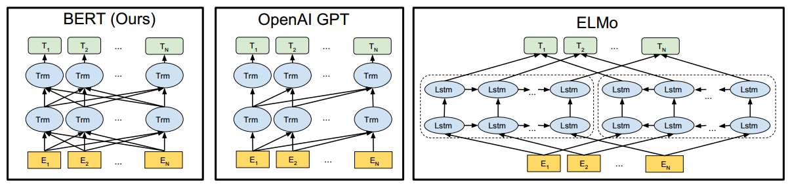
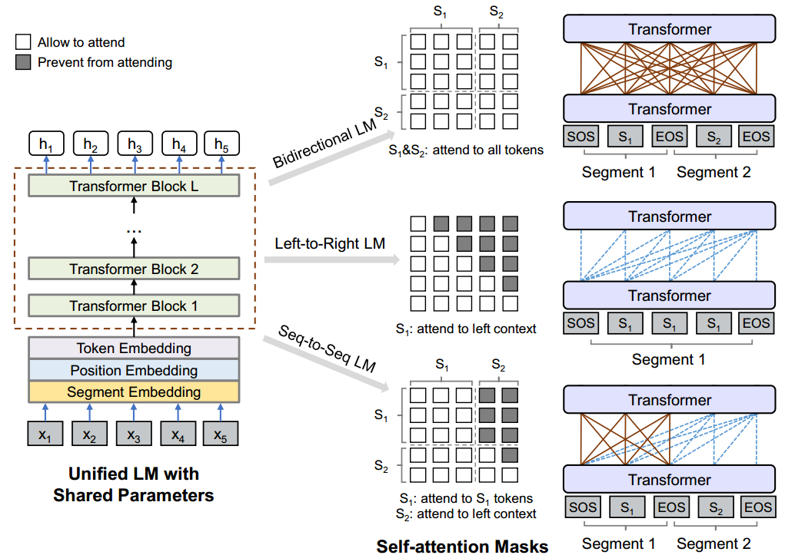
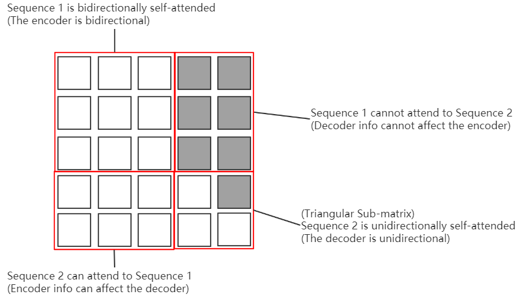

# UniLM

## Related Works (Previous)

- [ELMo](ELMo.md)
- [BERT](BERT.md)

### Differences in pre-training model architectures

## Intruduction

### Different LM Objectives

|Method              |Context                       |Common Architecture|
|:------------------:|:-----------------------------|:-----------------:|
|Left-to-Right       |leftward                      |Encoder            |
|Right-to-Left       |rightward                     |Encoder            |
|Bidirectional       |both                          |Encoder            |
|Sequence-to-Sequence|source: both, target: leftward|Encoder-Decoder    |

### Advantages of UniLM

- Using the shared parameters and architecture for different types of LMs. The only difference among different LM architectures is the **mask matrix**.
- Representations are jointly optimized for different LM objectives (where context is utilized in different ways), mitigating overfitting to any single LM task.
- The input of UniLM can be a pair of sentences like BERT, in addition, UniLM is able to handle seq2seq taks like an encoder-decoder, because it can ensure the attention in the target sequence to be left-to-right.

## UniLM Pre-training

- Input can be one sequence $S_1$ or a pair of sequences ($S_1, S_2$)

- Different types of LMs are configured with different masks

  - Bidirectional: $S_1$ and $S_2$ can both attend to all tokens
  - Left-to-Right: $S_1$ can attend to left context
  - Seq-to-Seq: $S_1$ can attend to $S_1$ tokens, and $S_2$ can attend to left context

### Input Representation

- [SOS]: Start of Sequence
- [EOS]: End of Sequence, marking the boundary of the sentence for NLU tasks, and enabling the NLG tasks to learn when to terminate
- Token Embedding: Text are tokenized to subword units instead of simple words by WordPiece
- Position Embedding
- Segment Embedding: To indicate which segment of the pair is the token in
- Final Embedding: Token Embedding + Position Embedding + Segment Embedding

### Backbone Network: Multi-Layer Transformer

The Hidden Vector

- Input vector: $\bold{H}^0 = [\bold{x}_0, \bold{x}_1, \cdots, \bold{x}_{|x|}]$
- Hidden vector of layer $l$: $\bold{H}^l = \text{Transformer}(\bold{H}^{l-1}) = [\bold{h}_0^l, \bold{h}_1^l, \cdots, \bold{h}_{|x|}^l], l\in[1, L]$

Calculation inside the Transformer Block

$$
\bold{A}_l = \text{softmax}(\frac{\bold{Q}\bold{K}^T}{\sqrt{d_k}} + \bold{M})\bold{V} = \text{softmax}(\frac{(\bold{H}^{l-1}\bold{W}^Q)(\bold{H}^{l-1}\bold{W}^K)^T}{\sqrt{d_k}} + \bold{M})(\bold{H}^{l-1}\bold{W}^V)
$$

- $\bold{A}_l$: the output of a single self-attention head, therefore $
\bold{H}_l = \text{concat}(\{\bold{A}_l^i\}_{i=1}^A)\bold{W}^O$, where $\bold{A}_l^i$ means the $i$-th head of the $l$-th layer's output.
- $\bold{M}$: binary mask matrix, $0$ for allowing the attention, $-\infty$ for preventing the attention.
- $\bold{Q},\bold{K},\bold{V},\bold{W}^Q,\bold{W}^K,\bold{W}^V$: see referenced article.

### Pre-training Objectives

Take cloze task as an example

#### Unidirectional LM

- Description: Given a masked sequence $x_1 x_2 [\text{MASK}] x_4$, either only $x_1$ and $x_2$ can be used for predicting $[\text{MASK}]$, or only $x_4$ can be used. The former is left-to-right LM, while the latter is right-to-left.
- Transformer Mask: Triangular matrices, in order to prevent and only prevent attentions of one direction. Lower triangulars for left-to-right ones, and upper triangulars for right-to-left ones.

#### Bidirectional LM

- Description: Given a masked sequence $x_1 x_2 [\text{MASK}] x_4$, both $x_1 x_2$ and $x_4$ can be used for predicting $[\text{MASK}]$.
- Transformer Mask: No mask, in order to allow all attentions/

#### Sequence-to-Sequence LM

- Description: Given source sequence $x_1 x_2$ and its target sequence $x_3 x_4 x_5$, the input of UniLM is composed as $[\text{SOS}]x_1 x_2[\text{EOS}]x_3 x_4 x_5[\text{EOS}]$. A token will be randomly chosen to be masked in each segments, resulting in a sequence $[\text{SOS}]x_1 [\text{MASK}] [\text{EOS}]x_3 [\text{MASK}] x_5[\text{EOS}]$. The model will learn to recover the masked tokens as before, and the relationship between two sequences will also be learned implicitly since they are packed together.
- Transformer Mask: Split the mask matrix into four sub-matrices, respectively representing the attention between $(s_1,s_1)$, $(s_1,s_2)$, $(s_2,s_1)$, $(s_2,s_2)$. Mask the corresponding positions out to prevent $s_2$ from attending to its rightward tokens.
- Unlike the common seq2seq method, here the source and the target sequences are represented as one vector.
- This is feasible because the mask matrix can be configured to regard the first sequence as the source and the second one as the target.

#### Can previously proposed LMs mentioned in this article handle seq2seq tasks?

- BERT
  - BERT can do seq2seq tasks such as NSP, extractive QA.
  - The input can also be packed to a (source, target) pair, and the embeddings contain the segment info as UniLM do.
  - The NSP task is like a sequence to sequence task, but not exactly. In NSP, the target sequence does not need to be generated token by token from left to right, but just a simple mapping between the source and the target sentence. So each token of the target sequence can attend to all words in the target sequence.
  - Conclusion: BERT can do extractive seq2seq, but cannot do generative seq2seq.

- ELMo is feature based, so it depends on the downstream mdoel.

### Pre-training Setup

#### Time Allocation

|LM Type                |Time|
|:---------------------:|:--:|
|Bidirectional LM       |1/3 |
|Sequence-to-Sequence LM|1/3 |
|Left-to-Right LM       |1/6 |
|Right-to-Left LM       |1/6 |

### Fine-tuning on Downstream Tasks

#### NLU

For NLU tasks, the UniLM is fine-tuned as a bidirectional Transformer encoder, like BERT.

Text Classification

- Use $\bold{h}_1^L$, the final hidden state of $[\text{SOS}]$, as the input of the softmax classifier.
- The class probabilities are computed as $\text{softmax}(\bold{h}_1^L\bold{W}^C)$, where $\bold{W}^C\in\mathbb{R}^{d_h\times C}$ is a parameter matrix, and $C$ is the number of categories.
- Training to update both $\bold{W}^C$, the weight of the downstream classifier, and the weight of UniLM.

**Why can $\bold{h}_1^L$ represent the whole sequence? Can other $\bold{h}_i^L$ represent it?**

Each token will attend to each token with certain attention value. After training with the Transformer Block, the output $\bold{h}_i^L$ is actually a weighted sum of all tokens, that is

$$
\bold{h}_i^L = \sum_{j=1}^Nw_{i,j}\bold{x}_j
$$

where $w_{i,j}$ is the softmaxed attention, namely the weight. We can separate the sum into 2 parts, one is the original info, the other is the context info

$$
\begin{aligned}
\bold{h}_i^L &= \sum_{j=1}^Nw_{i,j}\bold{x}_j \\
&= \bold{x}_i + (\sum_{j=1}^Nw_{i,j}\bold{x}_j - (1-w_{i,i})\bold{x}_i) \\
\end{aligned}
$$

For each $i$ possible, $\bold{h}_i^L$ contains all info of the sequence, but only when $i=1$, the original info $\bold{x}_i = \bold{x}_1$ will be a constant since $\bold{x}_1$ will always be $[SOS]$ regardless of how $\bold{x}$ changes. When $i\neq1$, the original info may be different for different input sequence $\bold{x}$.

The classifier only need the context info, so by adding the context info with a constant rather than a variable can reduce the noise of training data. And the first token may not be the only choice, if there is another deterministic position always with a deterministic token.

#### NLG

- Fine-tuning in NLG is similar to pre-training. The model is fine-tuned by masking some percentage of tokens in the target sequence at random, and learning to recover the masked words.

- The masking of $[EOS]$ of the target sequence is also meaningful, which encourages the model to learn when to emit the termination signal of the generation process of the target sequence.

### Some Questions

#### What's the difference between bidirectional and two unidirectional?

Mathematically their targets of training (MLE) are different.

- Bidirectional

$$
\arg\max_{\Theta} \sum_{i=0}^N \log p(t_i|t_0,t_1,\cdots,t_N;\Theta)
$$

- Two unidirectional

$$
\arg\max_{\Theta} \sum_{k=1}^N (\log p(t_k|t_1,\cdots,t_{k-1};\Theta) + \log p(t_k|t_{k+1},\cdots,t_N;\Theta))
$$

#### What's the difference between transfer learning and pre-training?

- Transfer learning focus mainly on the downstream task.
- Language model pre-training focus mainly on the architecture of the model to be pre-trained, including how to design its architecture to benefit the downstream tasks and how to integrate the pre-trained features.

#### What will be different by configuring different masks?

The connectivity between tokens will be different.

- Each element $m_{i,j}$ is a relation from $word_i$ to $word_j$
  - $m_{i,j} = 0$: $word_i$ cannot attend to $word_j$
  - $m_{i,j} = 1$: $word_i$ can attend to $word_j$
- Each sub-matrix $M_{i,j;k,l}$ is a relation from $sequence_{i,k}$ to $sequence_{j,l}$
  - $M_{i,j;k,l} = 0$: $sequence_{i,k}$ cannot attend to $sequence_{j,l}$
  - $M_{i,j;k,l} = I$: $sequence_{i,k}$ can attend to $sequence_{j,l}$ bidirectionally
  - $M_{i,j;k,l} = U$: $sequence_{i,k}$ can attend to $sequence_{j,l}$ left-to-right
  - $M_{i,j;k,l} = L$: $sequence_{i,k}$ can attend to $sequence_{j,l}$ right-to-left

The type of equivalent LSTM will be different.

|Mask|Type of equivalent LSTM|
|:-:|:-:|
|None|biLSTM|
|Upper Triangular|reversed-LSTM|
|Lower Triangular|LSTM|

#### Why will it work for seq2seq tasks by packing the source and target sequence together?

**From the perspective of the architecture:**

In tranditional Transformer,

1. the decoder self-attention is masked so that each word in the target sequence cannot attend to its rightward words, which is the same as that in the UniLM when the sub-matrix $(S_2, S_2)$ is configured to be lower triangular.

2. the encoder self-attention is not masked so that each word in the source sequence can attend to any words, which is the same as that in the UniLM when the sub-matrix $(S_1, S_1)$ is configured to be all-zero.

3. the encoder-decoder-attention is not masked so that each word in the target sequence can attend to each word in the source sequence, which is the same as that in the UniLM when the sub-matrix $(S_2, S_1)$ is configured to be all-zero.From another perspective (axis), each word in the source sequence can also attend to each word in the target sequence, but this perspective of attention is implicitly deprecated since $V$ is from the decoder instead of the encoder, so the sub-matrix $(S_1, S_2)$ is configured all-$-\infty$.

**From the perspective of the training process:**

In traditional encoder-decoder, the training error is calculated by the input (expected) and the output (predicted) of the decoder (target sequence). Finally the model will learn to predict the target sequence as expected.

In UniLM, there's no distinction of encoder and decoder, so the training is done by cloze tasks. The training error is calculated by the original sequence pair and the recoverd sequence pair. Finally the model will learn to recover masked words. When all target words are masked, the model is doing a sequence to sequence task.

**From the perspective of math:**

Define the attentions between sequence $S_1$ and $S_2$ computed by Transformer with mask $M$ as follows

$$
H = \text{Trm}_M(S_1, S_2)
$$

and the self-attention as follows

$$
H = \text{Trm}_M(S)
$$

Use $S_1 + S_2$ to represent the concatenation of the two sequences, and use $\text{Trm}(S)$ to represent the unmasked attentions.

Without loss of generality, we suppose the mask is a $01$-matrix (0 for masked, 1 for unmasked), and applying mask $M$ to $A$ is $M\cdot A$.

For the mask representing seq2seq architecture in UniLM

$$
M =
\begin{gathered}
\begin{matrix}
M_1 & O \\
I & M_2
\end{matrix}
\end{gathered}
$$

and the unmasked self-attention matrix of each token in the total sequence can be divided into four sub-matrices

$$
\text{Trm}(S_1 + S_2) =
\begin{gathered}
\begin{matrix}
\text{Trm}(S_1) & \text{Trm}(S_1,S_2) \\
\text{Trm}(S_2,S_1) & \text{Trm}(S_2)
\end{matrix}
\end{gathered}
$$

so

$$
\text{Trm}_M(S_1 + S_2) =
\begin{gathered}
\begin{matrix}
\text{Trm}_{M_1}(S_1) & O \\
\text{Trm}(S_2,S_1) & \text{Trm}_{M_2}(S_2)
\end{matrix}
\end{gathered}
$$

As a result, $\text{Trm}_M(S_1+S_2)$ contains all the information in its sub-matrices:

- $\text{Trm}_{M_1}(S_1)$, where $M_1 = I$, is a bidirectionally encoded result of $S_1$, the source sequence
- $\text{Trm}_{M_2}(S_2)$, where $M_2 = L$, is a left-to-right encoded result of $S_2$, the target sequence
- $\text{Trm}(S_2, S_1)$ is the encoder-decoder attention.

therefore, it's able to handle the seq2seq task.

## Experiments

### Abstractive Summarization

- Task: NLG, generating a concise and fluent summary conveing the key info in the input, where the summary is not constrained to reusing the phrases or sentences in the input text
- LM Type: Sequence-to-Sequence
- Datasets: CNN/DailyMail, Gigaword
- Input: (document, summary) (concatenated)
- Masking Probability: 0.7
- Batch Size: CNN/DailyMail-32, Gigaword-64
- Max Length: CNN/DailyMail-768, Gigaword-256
- Beam Search: beam_size=5, remove duplicated trigrams and tweak the max summary length on the dev set.

### Question Answering

#### Extractive QA

- Task: NLU, predicting the start and end positions of the answer spans with the passage.
- LM Type: Bidirectional
- Datasets: SQuAD, CoQA
- Input
  - first segment: (question-answer histories, input question, passage)
  - second segment: the answer
  - For yes/no questions, use the final hidden vector of $[SOS]$ to predict whether the input is a yes/no question, and whether the answer is yes or no
  - For other examples, select a passage subspan with the highest F1 score for training

#### Generative QA

- Task: NLG, generating free-form answers for the input question and passage. The extractive task can only predict subspans of the passage as answer.
- LM Type: Sequence-to-Sequence
- Datasets: CoQA
- Input
  - first segment: (question-answer histories, input question, passage)
  - second segment: the answer
- Masking Probability: 0.5
- Max Length: 512
- Bea Search: beam_size=3

### Question Generation

- Task: NLG, generating a question that asks for the answer.
- LM Type: Sequence-to-Sequence
- Datasets: SQuAD
- Input
  - first segment: (input message, answer)
  - second segment: generated question
- Masking Probability: 0.7
- Metrics: BLEU-4, METEOR, ROUGE-L

Generated questions can improve the QA model, as a data augmentation.

### GLUE Benchmark

- Tasks
  - question answering
  - linguistic acceptability
  - sentiment analysis
  - text similarity
  - paraphrase detection
  - natural language inference

## Conclusion and Future Work

### Cross-Lingual

### Multi-Tasking

Multi-Tasking vs. LM Pre-training

## Why UniLM?

UniLM provides a unified architecture for different kinds of language models. When you need to change your pre-training model, by using UniLM you only need to change the Transformer masks instead of the whole network architecture.
