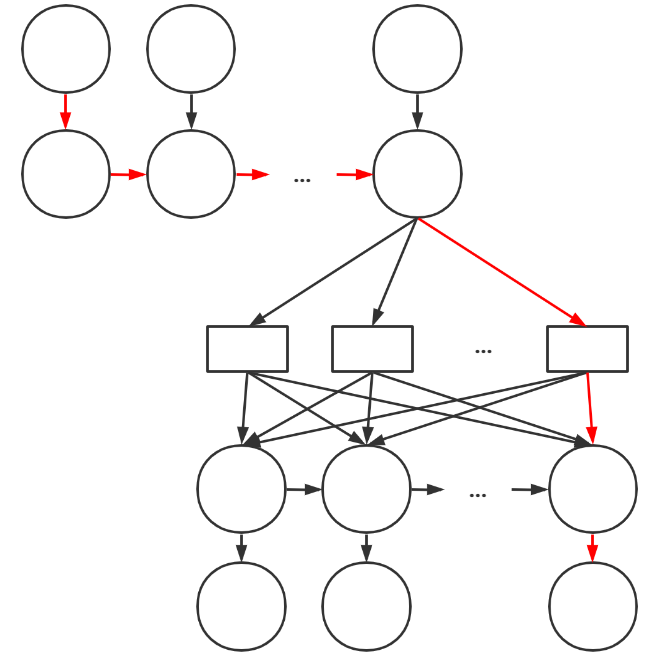
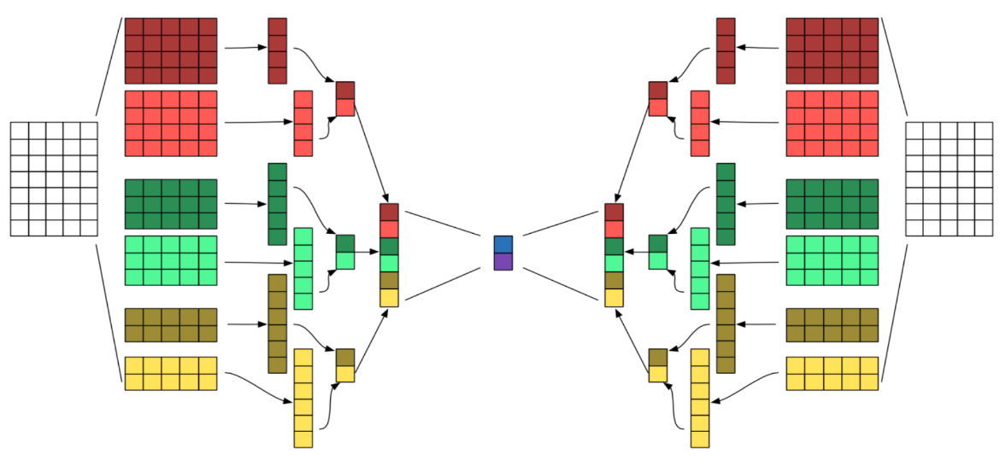

# Attention Is All You Need - Notes of Learning

## Prior Knowledges

- Recurrent Neural Networks (RNN, LSTM)
- Seq2Seq & Encoder-Decoder
- Attention Mechanism
  - Soft Attention & Hard Attention
  - Global Attention & Local Attention
  - Self Attention
- Beam Search
- BLEU Score

## Model Architecture

### Encoder and Decoder Stacks

- Encoder
  - Input Embedding
  - Positional Encoding
  - Multi-Head Attention with Residual & Norm (Self-attention)
  - Feed Forward Net with Residual & Norm

- Decoder
  - Output Embedding
  - Positional Encoding
  - **Masked** Multi-Head Attention with Residual & Norm (Self-attetion)
  - Multi-Head Attention with Residual & Norm (Co-attention)
  - Feed Forward Net with Residual & Norm
  - Linear, Softmax and Output

### Attention

#### Scaled Dot-Product Attention

In the encoder and first layer of the decoder, Q, K and V are different linear transformations of the same input X.

- Q·K: to calculate the self-attention

- scale: divide Q·K by sqrt(d_k), in order not to fall into extremely small gradients when d_k is large

- mask: the output at pos i can depend only on outputs at pos less than i, so the attention from the future should be masked

- softmax: ensure the sum of all attentions is 1, so they can be used as weight

- weights dot V: to produce a new query, in which each single vector is a linear combination (weighted sum) of all vectors in V.

#### What's Q K V mean?

In self-attention, $Q, K, V$ are different linear transformations (matrices $W^Q, W^K, W^V$) of the same input $X$.

In encoder-decoder-attention, $Q$ is from the encoder while $K, V$ are from the decoder.

- Shapes & Meanings

|Expression     |Shape             |Meaning|
|:-------------:|:----------------:|:------|
|$X $           |$(d_x, d_{model})$|the input has $d_x$ words, each word is represented as a $d_{model}$-dim vector|
|$W^Q, W^K$     |$(d_{model}, d_k)$|factors to do linear transformation|
|$W^V$          |$(d_{model}, d_v)$|factors to do linear transformation|
|$Q, K$         |$(d_x, d_k)$      |each of the $d_x$ words is transformed to a $d_k$-dim vector in two different ways|
|$V$            |$(d_x, d_v)$      |each of the $d_x$ words is transformed to a $d_v$-dim vector|
|$QK^T$         |$(d_x, d_x)$      |self-attention weights: how much each word attends to other words|
|$QK^TV$        |$(d_x, d_v)$      |each of the $d_x$ words is transformed to a $d_v$-dim vector by doing weighted sum, each vector contains the information of self-attention|

- Trainable Variables: $W^Q, W^K, W^V$

The network does the same thing to each word vector in the input sequence.

#### What will be learned in the attention module?

The target is to learn optimal $W^Q, W^K, W^V$, but what does optimal mean here?

##### It will learn how much each word attends to other words (the attention)

It's important to understand the following two statement is different from each other:

- how much $word_A$ attends to $word_B$.
- how much $word_B$ attends to $word_A$.

Consider such a situation:

- $word_A$ is **strongly** influenced by $word_B$
- $word_B$ is **slightly** influenced by $word_A$

And let's say $q_A, q_B$ is how $word_A, word_B$ are represented in $Q$, and $k_A, k_B$ is how $word_A, word_B$ represented in $K$, then:

- $q_Ak_B$ is large, which means $word_A$ is strongly influenced by $word_B$
- $q_Bk_A$ is small, which means $word_B$ is slightly influenced by $word_A$

In general, the $QK^T$ matrix can be represented as follows:

$$
\begin{gathered}
\begin{matrix}
1\rightarrow 1 & 1\rightarrow 2 & \cdots & 1\rightarrow x \\
2\rightarrow 1 & 2\rightarrow 2 & \cdots & 2\rightarrow x \\
\vdots & \vdots & \ddots & \vdots \\
x\rightarrow 1 & x\rightarrow 2 & \cdots & x\rightarrow x \\
\end{matrix}
\end{gathered}
$$

where $i\rightarrow j$ means how much $word_i$ attends to $word_j$.

And as the learning process runs, each value in the matrix above will be updated, which means the attentions between each pair of words will be updated, and will finally converge to an optimal attention.

##### It will learn how to compose a new sentence

The $QK^T$ matrix will then multiply the $V$ matrix, producing a new sentence as follows:

$$
\begin{gathered}
\begin{matrix}
(1\rightarrow 1)v_1 + (1\rightarrow 2)v_2 + \cdots + (1\rightarrow x)v_x \\
(2\rightarrow 1)v_1 + (2\rightarrow 2)v_2 + \cdots + (2\rightarrow x)v_x \\
\vdots \\
(x\rightarrow 1)v_1 + (x\rightarrow 2)v_2 + \cdots + (x\rightarrow x)v_x \\
\end{matrix}
\end{gathered}
$$

where each row is a new word vector which is a weighted sum of $v_i$ and $v_i$ means the vector of $word_i$ in $V$.

In self-attention, $V=W^VX$. As $W^V$ is updated, each $v_i$ will be updated, and each row of new word vector will be updated, which means the new sentence will be updated, and finally converge to an optimal sentence.

#### Multi-Head Attention

Multi-Head Attention is kind of like ensemble.

- The Attention will be done $h$ times, resulting in $h$ outputs of shape $(d_x, d_v)$.
- Then the $h$ outputs will be concatenated to matrix of shape $(d_x, hd_v)$.
- Then the concatenated matrix will multiply $W^O$ of shape $(hd_v, d_{model})$, which outputs a matrix of shape $(d_x, d_{model})$, which is of the same shape as the input matrix $X$.

Simple ensemble can only output a simple average on all outputs, while multi-head attention can learn to output a weighted average on all outputs (by updating $W^O$).

There is $d_k=d_v=d_{model}/h$ to ensure the total computational cost is similar to that of single-head attention with full dimensionality.

#### Applications of Attention in this Model

In this model, Attention is applied in three places

- encoder-decoder attention
  - $Q$ is from the encoder, $K$ and $V$ is from the decoder
  - $QK^T$ is the encoder-decoder attention
  - $Softmax(\frac{QK^T}{\sqrt{d_k}})V$ is a new sentence composed using vectors from decoder
- encoder self-attention
  - $Q, K, V$ are all from the encoder
  - each position can attend to all positions
- decoder self-attention
  - $Q, K, V$ are all from the decoder
  - each position can only attend to all positions up to and including that position
  - the mask masking out all leftward attentions (similar to an upper triangular matrix)
  $$
  \begin{gathered}
  \begin{matrix}
  1 & 1 & 1 & \cdots & 1 \\
  -\infty & 1 & 1 & \cdots & 1 \\
  -\infty & -\infty & 1 & \cdots & 1 \\
  \vdots & \vdots & \vdots & \ddots & \vdots \\
  -\infty & -\infty & -\infty & \cdots & 1 \\
  \end{matrix}
  \end{gathered}
  $$

### Position-wise Feed-Forward Networks

- FFN is applied to each position **separately** and identically
- Can view this operation as convolution with kernel size (1, 1)
- Hyperparameters: 3 layers in total, 2048 for the hidden layer.

#### Why position-wise?

Look dialectically

- To increase the depth to fit well
- To reduce connections and parameters to prevent overfitting

### Embeddings and Softmax

- Embedding operation learns from the corpus and can convert words to semantic vectors, which can represent the meanings of the words.
- Words of similar semantics will have small vector distance after embedded.
- Pre-softmax linear transformation: the inverse operation of embedding, so it can share weights with the embedding layers.
- Softmax: to output probability.

It's understandable the output embedding layer shares weights with the pre-softmax, but why the input embedding layer also does?

Answer: Maybe different language of corpus are combined when doing embeddings.

### Positional Encoding

There's no recurrence and convolutions in the model, so the position information should be manually added.

#### Fixed Positional Encoding

- Use sine and cosine functions to calculate position information
- Sine for even dimensions, cosine for add dimensions
- Different wavelengths (periods) for difference dimensions

$$
\begin{aligned}
PE_{(pos,2i)} &= sin(pos/10000^{2i/d_{model}}) \\
PE_{(pos,2i+1)} &= cos(pos/10000^{2i/d_{model}})
\end{aligned}
$$

where $i$ is the dimension (length of sequence).

#### Learned Positional Encoding

Train to fit the positional encoding function

#### Why sine and cosine functions?

When $i$ is even,

$$
\begin{aligned}
PE_{(pos+k,2i)} &= sin(pos/10000^{2i/d_{model}} + k/10000^{2i/d_{model}}) \\
&= sin(pos/10000^{2i/d_{model}})cos(k/10000^{2i/d_{model}}) + cos(pos/10000^{2i/d_{model}})sin(k/10000^{2i/d_{model}}) \\
&= cos(k/10000^{2i/d_{model}})PE_{(pos,2i)} + sin(k/10000^{2i/d_{model}})PE_{(pos,2i+1)}
\end{aligned}
$$

$PE_{(pos+k,2i)}$ is a linear combination of $PE_{(pos,2i)}$ and $PE_{(pos,2i+1)}$ for fixed $k$ and $i$. So each position information can be linearly combined by previous position informations, which can be a kind of recurrence.

## Why Self-Attention (Experimentally)

Three metrics of performance

### Complexity per Layer

- In RNN with attention mechanism, there is a full connection between two layers both of $d$ neurons, so the number of all edges is $d^2$. And the connection will **recur** $n$ times, so the total complexity is $O(nd^2)$. Furthermore, there is an $n-n$ connection in the attention mechanism, which produce complexity of $O(n^2d)$. In practice, $n$ is often much smaller than $d$, so the final complexity is $O(nd^2)$.

- In CNN with attention mechanism, each kernel has $kd$ parameters, and the conv operation will be done along the sequence, which produce a complexity of $O(n)$, so the total complexity is $O(knd)$

- In the self-attention model, the complexity of matrix multiplication $W^QX, W^KX, W^VX$ are all $O(ndk)$, where $k$ can up to $n$ in self-attention, so these three multiplication are all of complexity $O(n^2d)$ (shape$(n, d)$ dots shape$(d, n)$). Later, the multiplication of $QK^T$ and $V$ also produces complexity of $O(n^2d)$ (shape$(n, n)$ dots shape $(n, d)$).

### Sequential Operation (Relative)

- In RNN, there are $n$ different time steps, and they should be run sequentially, so the minumum SO is $O(n)$.

- In other models, there's no concept of time and recurrence, and they can deal with each word in parallel, which means the minimun SO is $O(1)$.

### Max Path Length

The longest path in RNN is the dependency between the first input and the last output, which need to go across the whole hidden states chain to flow the data.

In CNN model, if the kernel size equals $k$, then the model is like a k-ary tree whose depth is $O(\log n)$.

In the self-attention model, the depth has nothing to do with the length $n$, and is determined by hyperparameters of the model, so the depth is $O(1)$.

### Restricted Self-Attention

Consider only $r$ neighbors of each word, instead of all $n$ words.

- The $O(n^2d)$ attention matrix multiplication becomes $O(rnd)$
- The max length path will be $O(n/r)$. If the last word of input would like to attend to the first word of output, it should attend to the $(n-r)$th words, then the $(n-2r)$th words, ..., $n/r$ times in total.
- There's still no time and recurrence, so the mininum SO is still $O(1)$

### Side Benefit

Attention heads appear to exhibit behavior related to syntatic and semantic structure of the sentences.

## Training

### Datasets

WMT 2014 English-German: 4.5M sentence pairs
WMT 2014 English-French: 36M sentence pairs

### Byte-Pair Encoding

[BPE Algorithm](https://zhuanlan.zhihu.com/p/86965595)

### Batching

- Sentence pairs were batched together by approximate sequence length
- Each training batch contains nearly 25000 source tokens and 25000 target tokens

### Regularization

1. Apply dropout to the output of each sub-layer
2. Apply dropout to the sums of embeddings and positional encodings
3. Apply dropout to attentions, so that $$Attention(Q,K,V)=dropout(softmax(\frac{QK^T}{\sqrt{d_k}})V)$$

What's the difference between 1 and 3?

### Label Smoothing

To smooth the one-hot label

- before smoothing: [0, 1, 0, 0, 0]
- after smoothing with $\epsilon_{ls}=0.1$: [0.025, 0.9, 0.025, 0.025, 0.025]

## Results

### Machine Translation

#### EN-DE

- The big model achieves 28.4 BLEU which outperforms the best previously reported models (including ensembles) by more than 2.0 BLEU.
- Even the base model surpasses all previously reported models and ensembles, with much lower training cost.

#### EN-FR

- The big model achieves 41.0 BLEU which outperforms the previously reported single models, at less than 1/4 the training cost of the
previous state-of-the-art model.
- The EN-FR big model used dropout=0.1 instead of 0.3

#### Averaging Checkpoints

- The base model averages the last 5 checkpoints
- The big model averages the last 20 checkpoints

#### Use of Beam Search

Three kinds of searching

- Greedy: directly interpret each vector to the most possible word
- Brute Force: search each possible word for each iteration
- Beam Search: search the most possible $k$ words for each iteration

Explanation: the currently optimal word may not results in a globally optimal sentence, so the non-optimal words should also be given a chance to make up the sentence.

It's easy to think of using **Reinforcement Learning** to generate the globally optimal sentence.

- The action: select a possible word
- The reward: naively thinking, the reward can be the probability value
- The state: the current word, along with the current network

### Model Variations

Variable Hyperparameters

- $N$: the number of layers in encoder and decoder
- $d_{model}$: the length of each word vector
- $d_{ff}$: the number of neurons in the hidden layer of the FFN
- $h$: the number of heads
- $d_k$: the first dimension of $W^Q$ and $W^K$
- $d_v$: the first dimension of $W^V$
- $P_{drop}$: dropout rate
- $\epsilon_{ls}$: label smoothing rate

### English Constituency Parsing

Parse a sentence to something like a semantic tree, which is subject to strong structural constraints and is significantly longer than the input.

This reminds me of my previous ideas: NLP + Software Engineering

- Parse a naturally stated requirements to code (Maybe it's just a fantasy due to the very limited training data)
- Parse a naturally stated test case to a structural test case
- Parse a natrually stated API document to Python code for API testing

## Conclusion

Future

- Extend the Transformer to problems involving input and output modalities other than text
- Investigate local, restricted attention mechanism to efficiently handle large inputs such as images, audio and video
- Making generation less sequential

## What's new compared to the 1st version of this paper

- The authors experimented with using learned positional embeddings and found that the two versions produces nearly identical results
- Published the code
