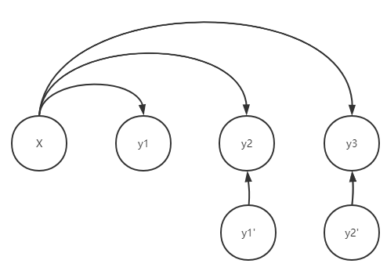

# Generating Attractive Ads

## Masked Sequence Generation

### Common

- the generated token $\hat{y}_t \sim p_\theta(\cdot|\bold{x},\hat{\bold{y}}_{< t})$
- the baselining token $\bar{y}_t \sim p_\theta(\cdot|\bold{x},\bar{\bold{y}}_{< t})$
- Dependencies: $\hat{y}_t$ depends on $\hat{y}_{t-1}$ which depends on $\hat{y}_{t-2}$ which depends on ... depends on $\hat{y}_1$ which depends on $\bold{x}$.

### MSG

- If the human-written token $y_t$ is not masked,

  - the generated token $\hat{y}_t$ will be set to $y_t$
  - the baselining token $\bar{y}_t$ will be set to $y_t$

- If the human-written token $y_t$ is masked,

  - the generated token $\hat{y}_t \sim p_{\theta}(\cdot|\bold{x},\bold{y}_{<t \backslash M})$
  - the baselining token $\bar{y}_t \sim \arg\max_{y'} p_{\theta}(y'|\bold{x},\bold{y}_{<t \backslash M})$

- Dependencies: $\hat{y}_t$ depends only on human-written tokens and $\bold{x}$
- It's parallelizable, since it does not have to wait the generation of the previous token, and the complexity on the **token length axis** is reduced.

### Exposure Bias

MSG suppose ground-truth (human-written) tokens are available during generation to make the generation task parallelizable

||Training Time|Testing Time|
|:-:|:-:|:-:|
|**Professor Forcing**||(Common)|
|**MSG**|(Common)||

But the fact is that the ground-truth tokens are unavailable at testing time, thus the policy used at masked sequence generating time is different from that used at real testing time. This is an off-policy problem, and a traditional method in RL, **Importance Sampling** is applied.

### Importance Sampling

Two policies

- MSG Policy (bottom right of the table above)
- Decoding Policy (upper right of the table above)

## Questions

- Which policy is currently deployed online for users, the $\theta$ or the $\theta'$?

- In Figure 1, does the "30%" in the Ad title come from the product landing page? How does the model deal with such important, formal words (numbers, dates etc.) which should remain completely the same, since the learned model cannot ensure that.

## Innovation

- Generating in parallel
- Off-policy RL
