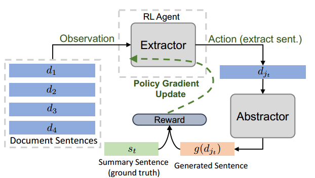

# Fast Abstractive Summarization with Reinforce-Selected Sentence Rewriting

## Model

### Definitions

- Training Set (document-summary pairs): $\{x_i,y_i\}_{i=1}^N$
- Latent Function: $h: X \mapsto Y, h(x_i) = y_i$, mapping a document to a summary, both of which are a set of sentences.
- Latent Function:

  $$
  \forall s \in S_i, \exist d \in D_i,\text{ s.t. } g(d) = s
  $$

  where $S_i$ is the set of summary sentences in $y_i$, and $D_i$ is the set of document sentences in $y_i$. i.e., every summary sentence can be produced from some document sentence. $g: D \mapsto S$, mapping a sentence from document to a sentence in summary.
- Latent Function: $f: X \mapsto D^n$, mapping a document to a concatenation of $n$ sentences in document, which is an extractor.

### Submodules

- Extractor Agent: function $f$
- Abstractor Network: function $g$

### Extractor Agent (f)

The Extractor Agent consists of two networks, one as encoder and the other as decoder.

#### Hierarchical Neural Model (Encoder)

- Data Flow

$$
\text{Document} \xrightarrow{\text{CNN}} [r_1, r_2, \cdots, ] \xrightarrow{\text{bi-LSTM}} [h_1, h_2, \cdots, ]
$$

#### Selection Network (Decoder)

- 1st hop of attention

  $$
  a_j^t = v_g^{\mathsf{T}}\tanh(W_{g1}h_j + W_{g2}z_t)
  $$

  $a_j^t$ means the attention between $h_j$ from encoder and $z_t$ from decoder

  $$
  \begin{aligned}
  \alpha^t &= \text{softmax}(a^t) \\
  e_t &= \sum_j\alpha_j^tW_{g1}h_j
  \end{aligned}
  $$

  $e_t$ is an attention weighted sum of all $h_j$ for the $t$-th token in the decoder

- 2nd hop of attention
  
  similar to the 1st one, except $z_t$ is replaced by $e_t$.

  $$
  u_j^t = v_g^{\mathsf{T}}\tanh(W_{g1}h_j + W_{g2}e_t)
  $$

  $u_j^t$ is the second order attention between $h_j$ from encoder and $z_t$ from decoder

- Extraction probability
  - $j_t$ is the sentence selected by the decoder at time step $t$
  - If $j_t = j_k ,\exist k \lt t$, the probability of selecting $j_t$ is 0. This prevents redundant selection
  - Else, $j_t \sim \text{softmax}(u^t)$

- Data Flow

$$
\begin{aligned}
&[z_1, z_2, \cdots, z_t]
\xrightarrow[{[h_1, h_2, \cdots, h_j]}]{\text{attention}} [a^1, a^2, \cdots, a^t]
\xrightarrow{\text{softmax}} [\alpha^1, \alpha^2, \cdots, \alpha^t] \\
&\xrightarrow{\text{weighted sum on encoder axis}} [e_1, e_2, \cdots, e_t]
\xrightarrow[{[h_1, h_2, \cdots, h_j]}]{\text{attention}} [u^1, u^2, \cdots, u^t] \\
&\xrightarrow[\text{zero forcing}]{\text{softmax}} [P(j_1), P(j_2|j_1), \cdots, P(j_t|j_1,\cdots,j_t)]
\xrightarrow{\text{select from D}} [d_1, d_2, \cdots, d_t]
\end{aligned}
$$

### Abstract Network (g)

- Task: to compress and paraphrase an extracted document sentence to a concise summary sentence.

- Data Flow

$$
[d_1, d_2, \cdots, d_t] \xrightarrow{\text{encoder-aligner-decoder}} [s_1, s_2, \cdots, s_t]
$$

#### Copy Mechanism

- Refer to: *Get to the point: Summarization with pointergenerator networks*

## Learning

### Difficulties

- The zero-force operation is not differentiable, thus a policy gradient method is needed to bridge the back-propagation to form an end-to-end network.

- If randomly initialized
  - the extractor, then, irrelevant sentences would often be selected
  - the abstracor, then, the RL environment is unstable, and the RL reward sent back to the extractor would be noisy

### Solution

Train the extractor and the abstractor separately using MLE, and finally use the RL method to train the full model end-to-end.

#### Train the Extractor

Regard the extracting task as a classification task, the extracted document sentence is the classification label.

However, this kind of 'intermediate' label does not exists in the end-to-end document-summary dataset.

- 'proxy' target label: find the most similar document sentence $d_{j_t}$ by:

$$
j_t = \arg\max_i(\text{ROUGE-L}_{recall}(d_i, s_t))
$$

#### Train the Abstractor

Trained using the document-summary pairs $(d_{j_t}, s_t)$

#### What does ROUGE-L do?

- Splits the end-to-end training set pairs (document, summary) into two parts:
  - (document, extracted document sentences)
  - (document sentence, summary sentence)

- It generate (document sentence, summary sentence) pairs by **ROUGE-L similarity algorithm**. The abstractor is trained/pre-trained utilizing those pairs, thus the abstractor will finally produce a model similar to the **ROUGE-L similarity algorithm**.

#### Reinforce-Guided Extraction

##### MDP Formulation

At each extraction step $t$

- current state: $c_t = (D, d_{j_{t-1}})$, current document sentence sets and the previously selected document sentence
- action: $j_t \sim \pi_{\theta_a, \omega}(c_t, j) = P(j)$, the index of a document sentence, sampled from $P(j)$
- reward: $r(t+1) = \text{ROUGE-L}_{F_1}(g(d_{j_t}), s_t)$

##### RL Illustration

- Actor-Critic Method + Advantage Learning = Advantage Actor-Critic (A2C)

## Problem

### The Necessity of the Abstractor

The RL Agent only contains the extractor, while the abstractor is in the environment, and the abstractor is pre-trained using **ROUGE-L Similarity Algorithm**. So I have to ask, why can't we just replace the abstractor network with the untrainable **ROUGE-L Similarity Algorithm**, since the abstractor only used to produce the reward?

### Rewrite
