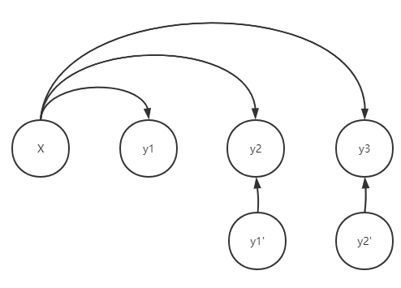
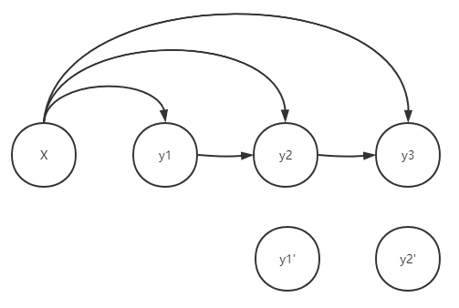
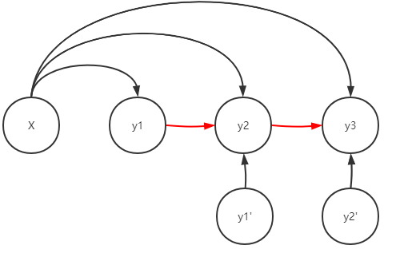

# Professor Forcing

## Intro

### Network Dynamics

The dynamics may refer to

- The structure of the units of a network
- The collective internal state of the network

In this paper, the dynamics probably means the parameter of the model.

### Unknowns (Before Reading)

- Behavior matching
- The auxiliary model (discriminator)
- Statistics vs. Single-Step
- Handling sequences much longer than the input sequences
- How it acts like a regularizer

### Teacher Forcing

#### Modeling and Training

Feeding back the ground-truth samples $y_t$ for the prediction of later outputs, which force the RNN to stay close to the ground-truth sequence.

#### Prediction

The ground-truth sequence is not available, $y_t$ is sampled from its conditional distribution given the previously generated samples.

Drawback: small prediction error will compound, leading to poor prediction performace, as the sequence of previously generated samples diverges from sequences seen during training.

### Bengio's Remedy (Scheduled Sampling)

Mixing two kinds of inputs during training:

- ground-truth sequence
- generated sequence

Drawbacks

- If the model generates several consecutive $y_t$'s, the correct target is suspicious.
- Scheduled sampling is a biased estimator, which in some situation will never converge even infinite examples and capacity are given.

### New Approach

#### Objectives

- To make the generative behavior and the teacher-forced behavior match as closely as possible
- To generate sequence beyond the length of the sequences it saw during training
- To better model long-term dependencies, by focusing on predicting observations more than one step. (See further)

## Proposed Approach: Professor Forcing

### Adversarial Perspective

- Generator: to generate **indistinguishable** sequences whether it is from the training sequences or self-generated.
- Discriminator: to **distinguish** self-generated sequences from training ones.

### Definitions and Notation

- $(\boldsymbol{x}, \boldsymbol{y})$: pairs of input and output sequences
- $\boldsymbol{\theta}_g$: parameters of generative RNN
- $\boldsymbol{\theta}_d$: parameters of discriminator
- $P_{\boldsymbol{\theta}_g}(\boldsymbol{y}|\boldsymbol{x})$: seq2seq model distribution
- $\boldsymbol{b}$: the behavior sequence, which is either from the training sequences or self-generated
- $B(\boldsymbol{x},\boldsymbol{y}, \boldsymbol{\theta}_g)$: the function that outputs the behavior sequence given the appropriate data
- $D(\boldsymbol{b})$: the output of the discriminator, estimating the probability that $\boldsymbol{b}$ was produced in teacher-forcing mode, given

### Training Objective

#### Discriminator

$$
C_d(\boldsymbol{\theta}_d|\boldsymbol{\theta}_g) = E_{(\boldsymbol{x}, \boldsymbol{y})\sim\text{data}}[-\log D(B(\boldsymbol{x}, \boldsymbol{y}, \boldsymbol{\theta}_g), \boldsymbol{\theta}_d) + E_{\boldsymbol{y}\sim P_{\boldsymbol{\theta}_g}(\boldsymbol{y}|\boldsymbol{x})}[-\log(1-D(B(\boldsymbol{x}, \boldsymbol{y}, \boldsymbol{\theta}_g), \boldsymbol{\theta}_d))]]
$$

Explain: when $\boldsymbol{x}, \boldsymbol{y}$ are both from dataset, $D(B(\boldsymbol{x}, \boldsymbol{y}, \boldsymbol{\theta}_g), \boldsymbol{\theta}_d)$ is expected to be 1, which is expected to be 0 when $\boldsymbol{y}$ is self-generated.

#### Generator

Maximize the likelihood of seq2seq model (Usual teacher-forcing)

$$
NNL(\boldsymbol{\theta}_g) = E_{(\boldsymbol{x}, \boldsymbol{y})\sim\text{data}}[-\log P_{\boldsymbol{\theta}_g}(\boldsymbol{y}|\boldsymbol{x})]
$$

Fool the discriminator

$$
C_f(\boldsymbol{\theta}_d|\boldsymbol{\theta}_g) = E_{\boldsymbol{x}\sim\text{data},\boldsymbol{y}\sim P_{\boldsymbol{\theta}_g}(\boldsymbol{y}|\boldsymbol{x})}[-\log D(B(\boldsymbol{x},\boldsymbol{y},\boldsymbol{\theta}_g), \boldsymbol{\theta}_d)]
$$

Maybe optionally

$$
C_t(\boldsymbol{\theta}_d|\boldsymbol{\theta}_g) = E_{(\boldsymbol{x}, \boldsymbol{y})\sim\text{data}}[-\log (1-D(B(\boldsymbol{x},\boldsymbol{y},\boldsymbol{\theta}_g), \boldsymbol{\theta}_d))]
$$

The final target is $NLL+C_f$ or $NLL+C_f+C_t$

## Related Work

- GAN

  Find out two adversarial objectives, and train to discriminate them

  - GAN discriminates between real samples and generated samples
  - Professor Forcing discriminates between hidden states from sampling mode and teacher forcing mode

- Scheduled Sampling

  See Intro

- Actor-critic/Self-critic

  See [this note](./self-critical-sequence-training-for-image-captioning.md)

## Experiments

### Networks Architecture and Professor Forcing Setup

- Generative RNN: single hidden layer GRU
- Computes a distribution

$$
P_{\boldsymbol{\theta}_g}(\boldsymbol{y}_{t+1}|\boldsymbol{h}_t) = P_{\boldsymbol{\theta}_g}(\boldsymbol{y}_{t+1}|\boldsymbol{x}_1,\cdots,\boldsymbol{x}_t,\boldsymbol{y}_1,\cdots,\boldsymbol{y}_t)
$$

- Two modes

  - In free-running mode, $\boldsymbol{y}_{t+1}$ is sampled from $P_{\boldsymbol{\theta}_g}(\boldsymbol{y}_{t+1}|\boldsymbol{h}_t)$
  - otherwise, the ground-truth $\boldsymbol{y}_t$ is used

- Behavior output

  - pre-tanh
  - softmax

- Discriminator

  - RNNs: bidirectional RNN, comprising two GRUs, running on top of $\boldsymbol{b}$ in two opposite directions
  - Hidden: The hidden states of these two RNNs are concatenated at each time step
  - Output: MLP, with an affine transformation and a rectifier in each layer, finally outputs $D(\boldsymbol{b})$ through a sigmoid

- Optional Back-propagation

  - Problem: when the discriminator is either too poor or too successful, it's harmful
  - Solution: when the discriminator is too poor, namely the classification accuracy is too low, not propagate the error to the generator (do not update $\boldsymbol{\theta}_g$), and conversely when its too successful, stop training the discriminator (do not update $\boldsymbol{\theta}_d$)

### Specific Tasks

- Character-Level Language Modeling

  - Penn-Treebank: corpus tagged with POS
  - Task: to generate character-level embeddings of a sentence

- Sequential MNIST

  - Task: sequentially generating the pixels in MNIST digits
  - CNN for discriminator

- Handwriting Generation
- Music Synthesis on Raw Waveforms
- Negative Results on Shorter Sequences

## Solve the Unknowns (After Reading)

### Behavior Matching

<table>
  <tbody>
    <tr>
      <th colspan="2">The Bayes Net of Different Behaviors</th>
    </tr>
    <tr>
      <td>
        
Teacher Forcing

        
        

          Each generated token is independent from other generated ones given the input X and the ground-truth previous token.
        

      </td>
      <td rowspan="2">
        
Test-time Generating

        
        

          Each generated token is independent from the ground-truth tokens, but is dependent to the previously generated token.
        

      </td>
    </tr>
    <tr>
      <td>
        
Professor Forcing

        
        

          Each generated token is not only dependent to the ground-truth tokens, but also dependent to the previously generated token.
        

      </td>
    </tr>
  </tbody>
</table>

The teacher-forcing method does not consider the dependencies among generated tokens, while the professor forcing take them into consideration.

### The auxiliary model (discriminator)

#### Objectives of GAN

- Generator: to cheat the discriminator
- Discriminator: to distinguish cheats

#### How do they affect each other?

||Generator|Discriminator|
|-:|:-|:-|
|**Generator**|Train to increase the accuracy of generator|Feed the behavior label, as well as all the data needed to discriminate the behavior|
|**Discriminator**|Back-propagate the error to the generator so the generator can do gradient descent to better fool the discriminator|Train to increase the accuracy of discriminator|

### Statistics vs. Single-Step

### Handling sequences much longer than the input sequences

### How it acts like a regularizer
