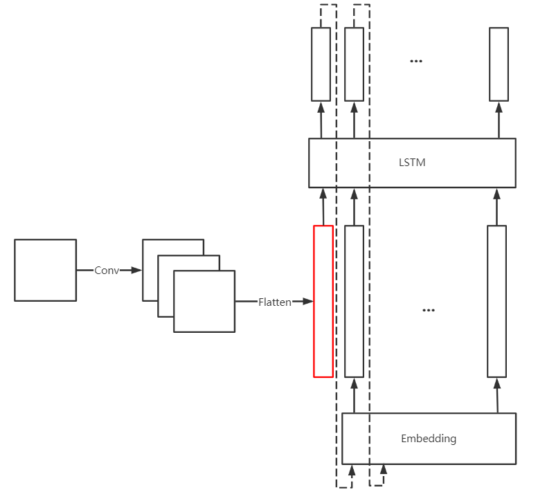
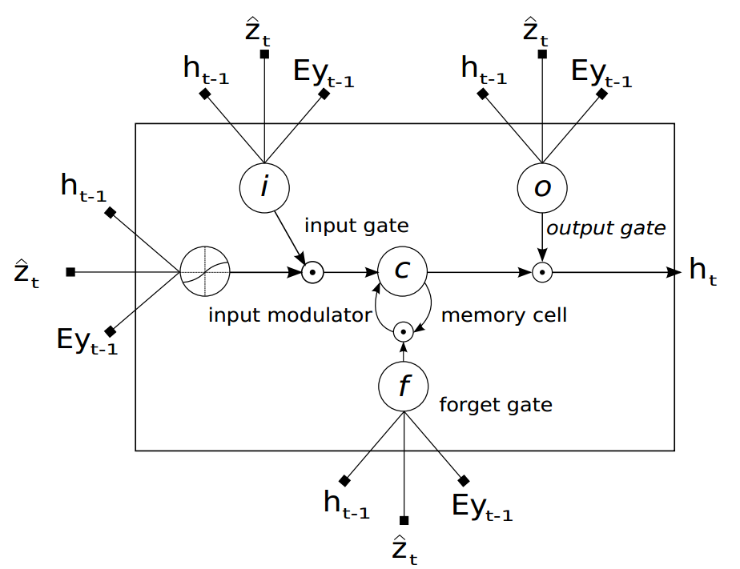
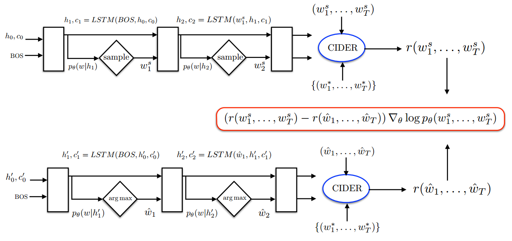

# Self-critical Sequence Training for Image Captioning

## Abstract & Introduction

### REINFORCE

REINFORCE is a Monte Carlo Policy Gradient method. The gradient of its performance is:

$$
\nabla J(\theta) \propto \sum_s\mu(s)\sum_aq_\pi(s,a)\nabla_\theta\pi(a|s,\theta)
$$

With a **baseline** like follows, the expectation of performance will not be changed, while the variance will be reduced

$$
\nabla J(\theta) \propto \sum_s\mu(s)\sum_a(q_\pi(s,a)-b(s))\nabla_\theta\pi(a|s,\theta)
$$

Rather than estimating a baseline to normalize the rewards and reduce variance, the **self-critical** method utilizes the output of its own test-time inference algorithm to normalize the rewards it experiences.

### Actor-Critic Methods

Monte Carlo is slow, and not convenient for continuing problems, due to the lack of bootstrapping (temporal-difference). Actor-critic methods have a bootstrapping critic.

- One-step Actor-Critic

$$
\begin{aligned}
\theta_{t+1} &\doteq \theta_t + \alpha(G_{t:t+1} - \hat{v}(S_t, w))\frac{\nabla_\theta\pi(A_t|S_t,\theta_t)}{\pi(A_t|S_t,\theta_t)} \\
&= \theta_t + \alpha(R_{t+1}+\gamma\hat{v}(S_{t+1},w)-\hat{v}(S_t,w))\frac{\nabla_\theta\pi(A_t|S_t,\theta_t)}{\pi(A_t|S_t,\theta_t)} \\
&= \theta_t + \alpha\delta_t\frac{\nabla_\theta\pi(A_t|S_t,\theta_t)}{\pi(A_t|S_t,\theta_t)}
\end{aligned}
$$

- Through multi-step we can choose the degree of bootstrapping

### Image Captioning

#### Basic Structure

An encoder-decoder structure, where the encoder is a CNN and the decoder is an RNN.

- Encoder: to obtain vectorial representation of images
- Decoder: to decode those representations into natural language sentences

### Exposure Bias

- At the training time, all inputs of the target sequence are ground truth value.
- But at the testing time, each input of the target sequence is generated by the model at the previous time step.

### Solutions to Exposure Bias

- Feeding back the model's own predictions, with slowly increase of the feedback probability.
- Professor forcing (Adversarial training)

### New Approach (SCST)

- Essentially, SCST is a REINFORCE algorithm
- Utilizes the output of its own test-time inference algorithm to normalize the rewards
  - its own: does not need another network to learn the baseline while the actor-critic method does
  - test-time: the baseline is computed using the sequence generated at test-time instead of training-time, which will contain accumulated error since the previous token is not always of ground-truth

## Image Caption Generation with Attention Mechanism

### Model Details

#### Encoder: Convolutional Features

Use CNN to extract feature (annotation) vectors, each of which is a D-dim representation corresponding to a part of the image.

$$
a = \{\bold{a}_1,\cdots,\bold{a}_L\}, \bold{a}_i\in\mathbb{R}^D
$$

Extract features from a lower layer to obtain a correspondence between the feature vectors and portions of the image.

#### Decoder: LSTM network

- Context vector: $\hat{\bold{z}}_t\in\mathbb{R}^D$, a dynamic representation of the relevant part of the image input at time $t$.
- Mechanism to compute context vector $\hat{\bold{z}}_t$
  - Input: annotation vectors $\bold{a}_i, i=1,\cdots,L$
  - For each location $i$, a positive weight $\alpha_i$ is generated
  - The weight $\alpha_i$ of each annotation vector $a_i$ is computed by an attention model $f_{\text{att}}$
  $$
  \begin{aligned}
  e_{ti} &= f_{\text{att}}(\bold{a}_i,\bold{h}_{t-1}) \\
  a_{ti} &= \frac{\exp(e_{ti})}{\sum_{k=1}^L\exp(e_{tk})} \\
  \hat{\bold{z}}_t &= \phi(\{\bold{a_i}\},\{\alpha_i\})
  \end{aligned}
  $$

## Caption Models

### FC Models

#### Data Flow of FC Models

$$
W_I\text{CNN}(F)
\xrightarrow{LSTM}
1_{w_1}
\xrightarrow{E}
x_1
\xrightarrow{LSTM}
1_{w_2}
\xrightarrow{E}
x_2
\xrightarrow{LSTM}
\cdots
$$

#### Math Description of FC Models

$$
\begin{aligned}
x_t &= E1_{w_{t-1}} \text{for} \ t>1, x_1=W_I\text{CNN}(F) \\
i_t &= \sigma(W_{ix}x_t+W_{ih}h_{t-1}+b_i) (\text{Input Gate}) \\
f_t &= \sigma(W_{fx}x_t+W_{fh}h_{t-1}+b_f) (\text{Forget Gate}) \\
o_t &= \sigma(W_{ox}x_t+W_{oh}h_{t-1}+b_o) (\text{Output Gate}) \\
c_t &= i_t \odot \phi(W_{zx}^\otimes x_t+W_{zh}^\otimes h_{t-1}+b_z^\otimes)+f_t\odot c_{t-1} \\
h_t &= o_t \odot \tanh(c_t) \\
s_t &= W_sh_t
\end{aligned}
$$

#### Limitations of FC Models



This model use CNN to encode the image to a representation vector, then use this vector as the first input of the decoder. It's an encoder-decoder **without attention mechanism**, except its encoder is a CNN instead of an RNN.

### Attention Model

In [6], the LSTM is designed like the figure followed:



In addition to the previous hidden state $h_{t-1}$, the current input token $Ey_{t-1}$, each gate is fed with a $\hat{z}_t$, which can represent the attention-derived image features.

In this paper, the attention-derived image feature ($I_t$, which is a weighted sum of CNN features in different locations) is fed only to the cell node of the LSTM.

#### Math Description of Attention Model

$$
\begin{aligned}
x_t &= E1_{w_{t-1}} \text{for} \ t>1, x_1=W_I\text{CNN}(F) \\
i_t &= \sigma(W_{ix}x_t+W_{ih}h_{t-1}+b_i) (\text{Input Gate}) \\
f_t &= \sigma(W_{fx}x_t+W_{fh}h_{t-1}+b_f) (\text{Forget Gate}) \\
o_t &= \sigma(W_{ox}x_t+W_{oh}h_{t-1}+b_o) (\text{Output Gate}) \\
c_t &= i_t \odot \phi(W_{zx}^\otimes x_t+\textcolor{red}{W_{zI}^\otimes I_t}+W_{zh}^\otimes h_{t-1}+b_z^\otimes)+f_t\odot c_{t-1} \\
h_t &= o_t \odot \tanh(c_t) \\
s_t &= W_sh_t
\end{aligned}
$$

## Reinforcement Learning

### Compare to non-RL methods

In non-RL methods, to get the final output sequence from the output probability distributions of the decoder, we generally use beam search or simply greedy algorithm.

In RL methods, each token of the output sequence is sampled from the corresponding probability distribution. This sampled sequence is then evaluated by CIDER and get a score as the reward signal. The agent (LSTM) receives the reward, then updates its parameter, namely the policy, thus update each output probability distributions.

### Reward Normalization (Baselining)

Since all CIDER (or other) scores are positive, all the reward signals will be positive, thus the learning process will be slow since there's no punishment for relatively bad actions. Baselining can solve this problem.

## SCST

Central Idea: to baseline the REINFORCE algorithm with the reward obtained by the current model under the inference algorithm used at test time.

$$
\frac{\partial L(\theta)}{\partial s_t} = (r(w^s)-r(\hat{w}))(p_\theta(w_t|h_t)-1_{w_t^s})
$$

$\hat{w}$ is a greedy action in this paper, and $w^s$ are different sampled actions. If the sampled action is better than the greedy action, the normalized reward signal is positive, thus the gradient is positive, thus the probability of this action will be increased.

### The Figure



There are two pipelines, the one above performs sampling actions, and the one below performs greedy actions.

Sampling Pipeline

- The hidden state and the cell node of LSTM are initialized to $h_0, c_0$ respectively
- The BOS token is fed into the LSTM, changing the hidden state and the cell node into $h_1, c_1$
- The next token $w_1^s$ is sampled according to current policy (model) $p_\theta(w|h_1)$
- Recursively feed $w_1^s$ to the LSTM.
- When meet the EOS token, stop and output the sequence $(w_1^s,\cdots,w_T^s)$
- Evaluate the sequence using common NLP evaluation methods (CIDER etc.)
- Get the reward $r(w^s)$

Greedy Pipeline

- The hidden state and the cell node of LSTM are initialized to $h_0', c_0'$ respectively
- The BOS token is fed into the LSTM, changing the hidden state and the cell node into $h_1', c_1'$
- The next token $\hat{w_1}$ is generated according to policy $p_\theta(w|h_1)$, where $\hat{w_1}=\arg\max_w p_\theta(w|h_1)$
- Recursively feed $\hat{w_1}$ to the LSTM
- When meet the EOS token, stop and output the sequence $(\hat{w_1},\cdots,\hat{w_T})$
- Evaluate the sequence using common NLP evaluation methods (CIDER etc.)
- Get the reward $r(\hat{w})$

Merge

- Produce reward signal: $(r(w^s)-r(\hat{w}))\nabla_\theta\log p_\theta(w^s)$
- Update the parameters of the LSTM: $\theta\leftarrow\theta+(r(w^s)-r(\hat{w}))\nabla_\theta\log p_\theta(w^s)$

### Baseline

The general form of the SCST baseline is

$$
b(s) = q_\pi(s, \arg\max_a\pi(a|s,\theta))
$$

compared to the traditional baseline

$$
b(s) = v_\pi(s) =  \sum_a\pi(a|s,\theta)q_\pi(s,a)
$$

the SCST baseline only considers the most possible action in current state, while the traditional one considers all possible actions.

To the specific problem, the baseline is

$$
\begin{aligned}
b_t &= r(\hat{w}_t) \\
\hat{w}_t &= \arg\max_{w_t} p(w_t|h_t)
\end{aligned}
$$

which is the reward of the greedy decoded sentence. With this baseline, each sequence whose reward is higher than the greedy one will cause a postive reward signal while lower ones will cause negative reward signals (punishment).

### Generalization

#### TD-SCST

Condition the baseline on what has been generated (sampled) so far.

In common SCST, each token of the sequence used to compute the baseline is from inference algorithm at test time, but in TD-SCST, part of the tokens could be from the training time.

- Common SCST: $\text{baseline}=r(\hat{w})$
- TD-SCST: $\text{baseline}=r(\bar{w})$, where $\bar{w}=\{w^s_{1:t-1},\hat{w}_{t:T}\}$, where the left part is from sampling at training time and the right part if from inference at testing time.

#### True SCST

In TD-SCST above, no token from the future can be sampled instead of infered, while True SCST allow part of tokens from the future to be sampled just like the tokens generated so far.

- TD-SCST above: $\text{baseline}=r(\bar{w})$, where $\bar{w}=\{w^s_{1:t-1},\hat{w}_{t:T}\}$
- True SCST: $\text{baseline}=r(\tilde{w})$, where $\tilde{w}=\{w^s_{1:t+n},\hat{w}_{t+n+1:T}\}$

When $n=-1$, the sequence reduced to TD-SCST above.

## Experiment

### Dataset

Data format of MSCOCO

```py
{
    'annotations': [{
            'image_id': 318556,#唯一的图片ID，此ID同时是图像文件名的序列号，对应的文件名：COCO_train2014_000000318556.jpg
            'id': 48, # 唯一的对象ID
            'caption': 'A very clean and well decorated empty bathroom'
        }
        ...
        ...
    ],
    'images': [{
            'license': 5,
            'date_captured': '2013-11-14 16:28:13',
            'flickr_url': 'http://farm4.staticflickr.com/3153/2970773875_164f0c0b83_z.jpg',
            'coco_url': 'http://images.cocodataset.org/train2014/COCO_train2014_000000057870.jpg',
            'id': 57870 #此id对应的是'annotations'中的image_id
            'width': 640,
            'file_name': 'COCO_train2014_000000057870.jpg',
            'height': 480
        }
        ...
        ...
    ],
    'licenses': [{
            'id': 1,
            'url': 'http://creativecommons.org/licenses/by-nc-sa/2.0/',
            'name': 'Attribution-NonCommercial-ShareAlike License'
        }
        ...
        ...
    ],
    'info': {
        'description': 'COCO 2014 Dataset',
        'year': 2014,
        'date_created': '2017/09/01',
        'contributor': 'COCO Consortium',
        'url': 'http://cocodataset.org',
        'version': '1.0'
    }
}
```

### Image Features

#### FC Model

- CNN: ResNet-101, with avg pooling
- feature vector: dim (2048,) / (15360,)

#### Spatial CNN features for Attention models (Att2in)

- Encode each image using ResNet-101
- No rescale, no crop
- CNN output shape: (14, 14, 2048), 14 rows, 14 cols, (196 locations), 2048 channels
- Attention mask: used as weights to spatially average the result to shape (2048,)

#### Implementation Details

- Embedding dimension: 512
- Model initialization: training the model under the XE objective using Adam Optimizer
- Increase the probability of feeding back a sample of the word posterior by epoch

## Conclusions & Questions

### different kinds of REINFORCE

||naive|baselined|actor-critic|SCST|
|-:|:-:|:-:|:-:|:-:|
|**baseline**|no|yes|yes|yes|
|**bootstrap**|no|no|yes|yes|
|**value estimation**|no|no|yes|no|
|**differentiable value function**|no|no|yes|no|

### What's the relation and difference between SCST and DQN?

From perspective of the architecture

- DQN is value-based, SCST is policy-based.
- DQN is supervised, since the gradient descent of the value function needs an experience pool $\{(S_{t-1},A_{t-1},R_t,S_t, A_t),\cdots\}$. SCST may be semi-supervised, because all training signals are generated real-time.

From perspective of the task

- The training objective of DQN is to optimize a value function, while for SCST is to optimize a policy function.
- In seq2seq task, the output of each time step is a probability distribution representing a specific word, which can be regarded as an output of policy $\pi$ naturally. Maybe the DQN can be modified to use the game action probability distribution as the output instead of using the score, such that the policy gradient method may be used.

### (Expected Sarsa, Q) vs. (Actor-critic, SCST)

- Temporal Difference
  - Expected Sarsa: $\delta_t=R_{t+1}+\gamma \sum_a \pi(a|S_{t+1})Q(S_{t+1},A_{t+1})-Q(S_t,A_t)$
  - Q: $\delta_t=R_{t+1}+\gamma \max_a Q(S_{t+1},a)$
- Baseline
  - Actor-critic: $\sum_a \pi(a|S_t)Q(S_t, a)$
  - SCST: $\max_{\pi(a|S_t)} Q(S_t,a)$

SCST is a modification of Actor-critic method. The relation between SCST and Actor-critic is similar to the relation between Q-Learning and Expected Sarsa. Since actor-critic method converges, the SCST method will also converge, intuitively.

### How does the model balance greedy and exploration?

During training, each token is sampled according to the output probability distribution, which is exploration.

During testing, each token is the most possible one in the probability distribution, which is greedy.

Finally as the agent learns well enough, the exploration is unecessary since the greedy decoding can achieve significant performance.

### Why the probability for the output posterior to be fed back is initially low?

Initially the model is not well optimized, and the output posterior is of high error, which is not a good RL training target, so at this time, the feedback probability should be low, thus more XE optimizing will be done before a posterior feedback.
